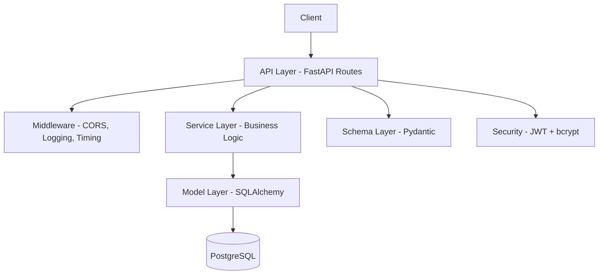

# App Starter

A production-ready FastAPI starter with async SQLAlchemy, JWT authentication, Docker, and CI/CD.

## Tech Stack

| Component | Technology |
|---|---|
| Framework | FastAPI 0.115+ |
| Language | Python 3.12+ |
| ORM | SQLAlchemy 2.0 (async) |
| Database | PostgreSQL 16 + asyncpg |
| Migrations | Alembic (async) |
| Validation | Pydantic v2 |
| Auth | JWT (python-jose) + bcrypt (passlib) |
| Linting | Ruff |
| Type Checking | Mypy (strict) |
| Testing | Pytest + pytest-asyncio + httpx |
| Server | Gunicorn + Uvicorn workers |
| Dependencies | Poetry |

## Architecture



## Project Structure

```
app-starter/
├── app/
│   ├── main.py              # App factory, lifespan, middleware
│   ├── core/                # Config, database, security, dependencies
│   ├── middleware/           # CORS, logging, timing
│   ├── models/              # SQLAlchemy models
│   ├── schemas/             # Pydantic schemas
│   ├── api/v1/              # Versioned route handlers
│   ├── services/            # Business logic
│   └── exceptions/          # Custom exceptions + handlers
├── alembic/                 # Database migrations
├── tests/                   # Pytest test suite
├── Dockerfile               # Multi-stage production build
├── docker-compose.yml       # Local dev stack
└── Makefile                 # Dev commands
```

## Local Setup

```bash
# 1. Install dependencies
make install

# 2. Copy and configure environment
cp .env.example .env.dev

# 3. Start database services
make docker-up
# Or start just postgres + redis:
# docker compose up -d postgres redis

# 4. Run migrations
make migrate

# 5. Start the dev server
make run
```

The API will be available at http://localhost:8000. OpenAPI docs at http://localhost:8000/docs.

## API Endpoints

| Method | Path | Auth | Description |
|---|---|---|---|
| GET | `/health` | No | Health check |
| POST | `/api/v1/auth/register` | No | Register new user |
| POST | `/api/v1/auth/login` | No | Login (OAuth2 form) |
| GET | `/api/v1/users/me` | Yes | Get current user |
| PATCH | `/api/v1/users/me` | Yes | Update current user |
| GET | `/api/v1/users/{id}` | Admin | Get user by ID |

## Environment Variables

| Variable | Required | Default | Description |
|---|---|---|---|
| `DATABASE_URL` | Yes | — | PostgreSQL connection string |
| `JWT_SECRET_KEY` | Yes | — | Secret for JWT signing |
| `APP_NAME` | No | App Starter | Application name |
| `DEBUG` | No | false | Enable debug mode |
| `ENVIRONMENT` | No | dev | dev / staging / prod |
| `DATABASE_POOL_SIZE` | No | 5 | SQLAlchemy pool size |
| `JWT_ACCESS_TOKEN_EXPIRE_MINUTES` | No | 1440 | Token TTL in minutes |
| `CORS_ORIGINS` | No | ["http://localhost:3000"] | Allowed CORS origins |
| `REDIS_URL` | No | redis://localhost:6379/0 | Redis connection |

## Docker

```bash
# Build and start everything
make docker-up

# Stop and remove volumes
make docker-down
```

## Testing

```bash
make test
```

## Linting & Formatting

```bash
# Check
make lint

# Auto-fix
make format
```
